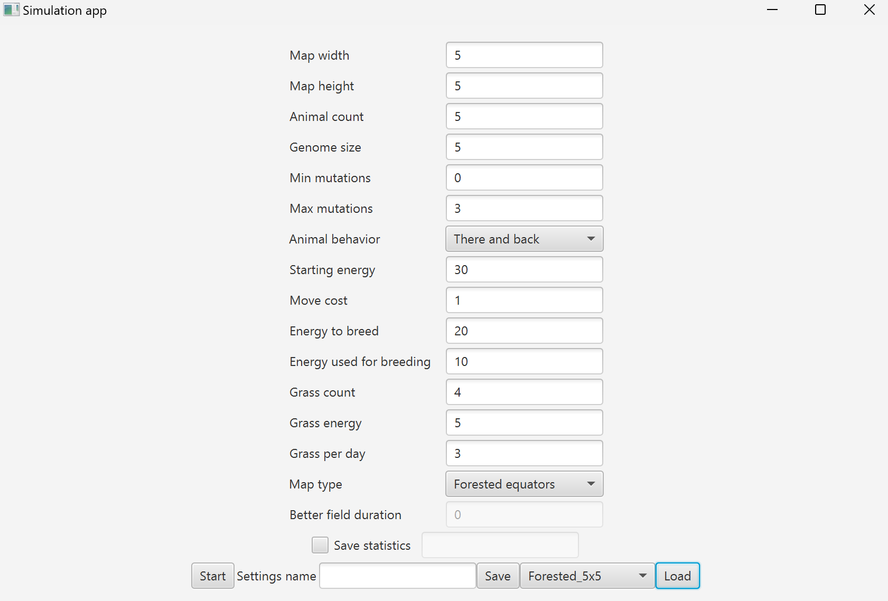
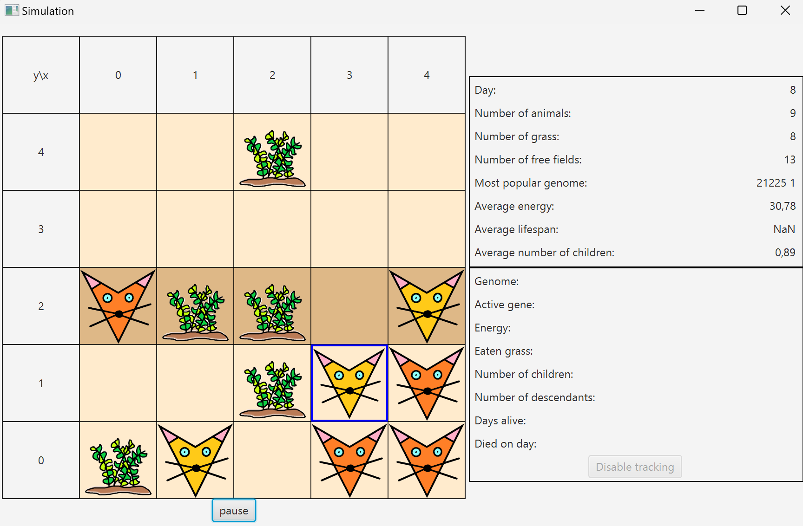
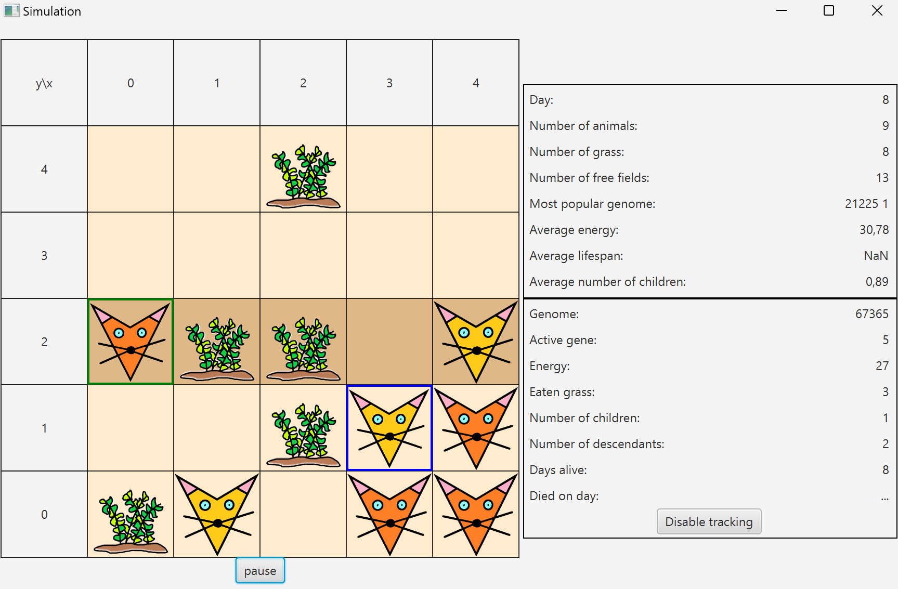
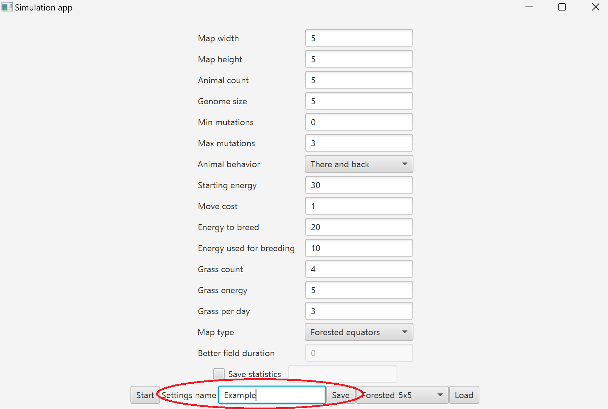
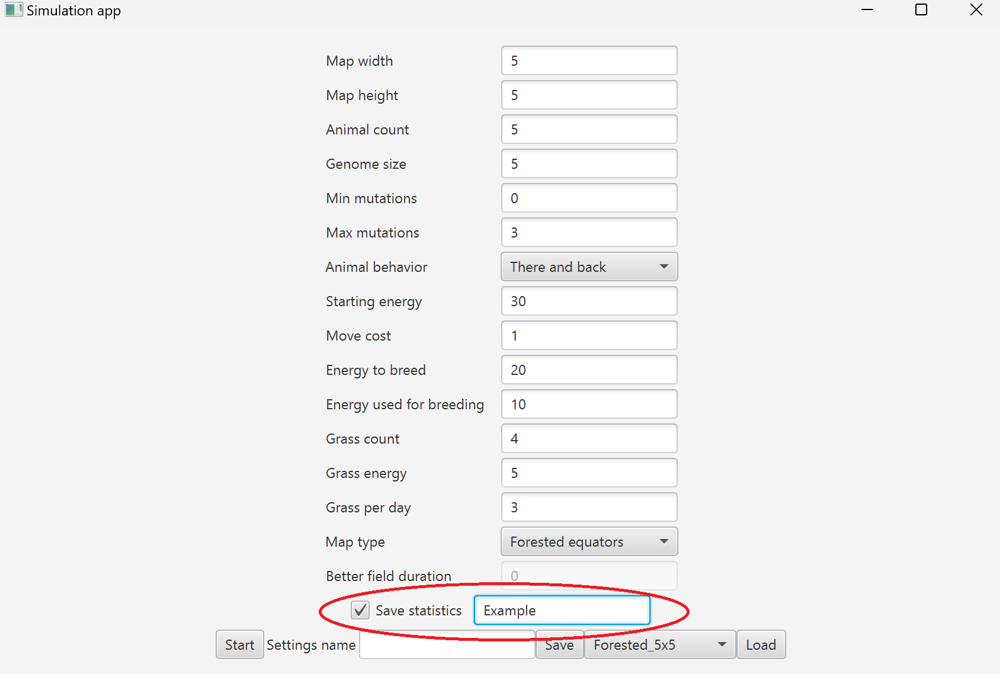

# Darwin World

## Project created for object-oriented-programming course at AGH.

## It is a simple darwin simulation made in Java using Gradle and JavaFX.

Every animal has its own energy, which is used for breeding and some energy is being also spent every day of the simulation. Each animal has also their own genotype, which determines their movement. When animals breed, their genotypes mix and newborn animal gets their own genotype based on parents and strategy chosen for simulation.

# Starting simulation

Before running the simulation user can specify settings. Depending on starting animal number, grass count, move energy cost and many more parameters, animals may have very easy life or impossible.

# Simulation

When the simulation is running it keeps track of some statistics, which gives better understanding of animals situation.

With each day of simulation many things happens:

- Dead animals are removed from map
- Animals change direction and move, which cost them energy
- Animal with highest energy on each field eats grass on it
- If there are two animals on the same field, they breed (if more than two, than two animals with highest energy)
- New plants grow on the map
- Statistics are updated

User can pause the simulation at any moment and then track statistics of a chosen animal.

# Saving configuration to CSV 

User can save simulation settings into CSV file before running simulation. It is possible to load them for another simulation.

# Saving statistics to CSV

Before running the simulation, user can decide whether or not application should save statistics from each day into CSV file.

